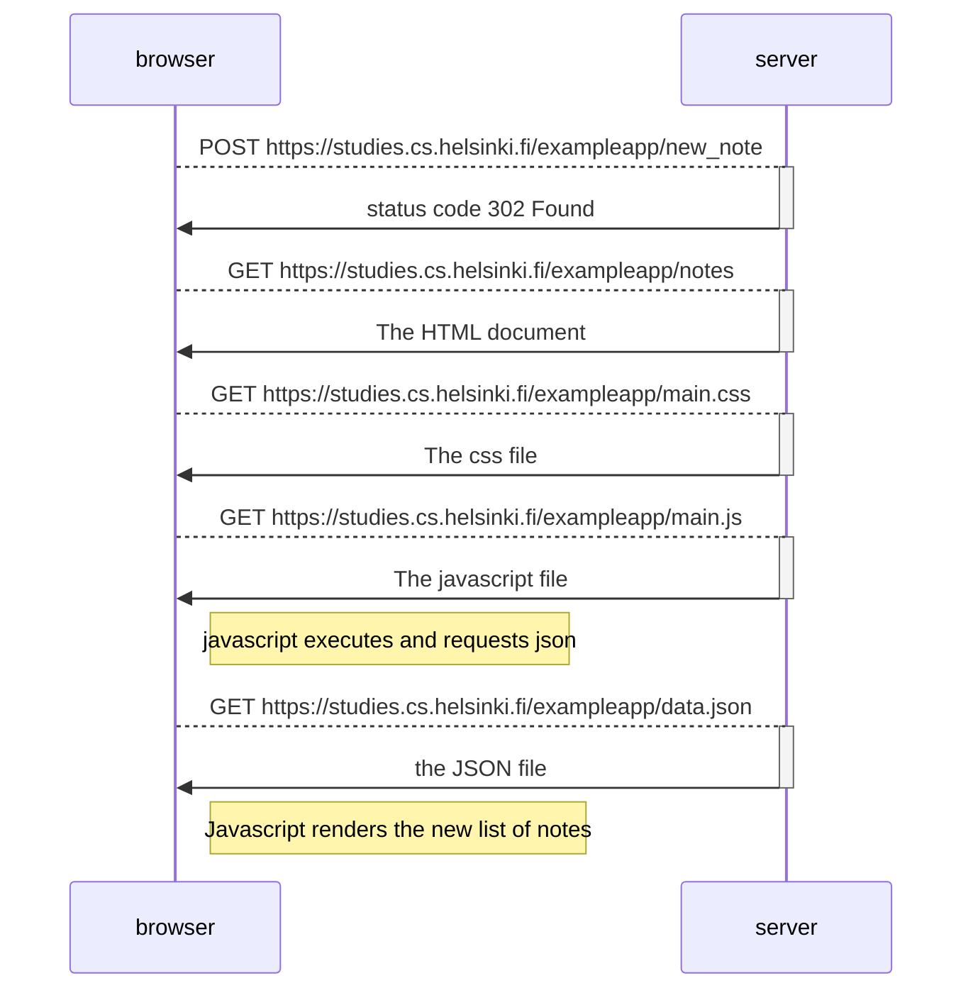

```mermaid
sequenceDiagram
  participant browser
  participant server

  browser-->server: POST https://studies.cs.helsinki.fi/exampleapp/new_note
  activate server
  server->>browser: status code 302 Found
  deactivate server

  browser-->server: GET https://studies.cs.helsinki.fi/exampleapp/notes
  activate server
  server->>browser: The HTML document
  deactivate server

  browser-->server: GET https://studies.cs.helsinki.fi/exampleapp/main.css
  activate server
  server ->> browser : The css file
  deactivate server

  browser-->server: GET https://studies.cs.helsinki.fi/exampleapp/main.js
  activate server
  server ->> browser : The javascript file
  deactivate server

  Note right of browser : javascript executes and requests json

  browser-->server: GET https://studies.cs.helsinki.fi/exampleapp/data.json
  activate server
  server ->> browser : the JSON file
  deactivate server

  Note right of browser : Javascript renders the new list of notes
```
