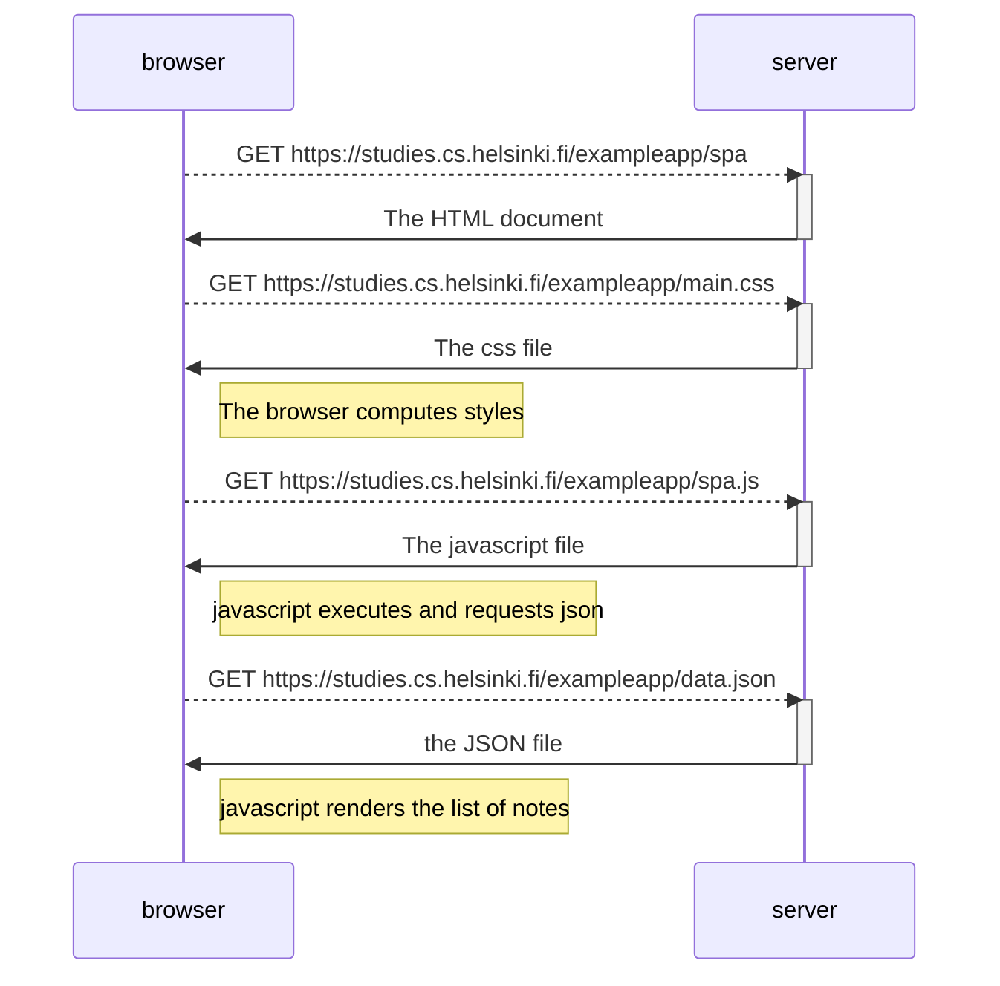

```mermaid
sequenceDiagram
  participant browser
  participant server

  browser-->>server: GET https://studies.cs.helsinki.fi/exampleapp/spa
  activate server
  server->>browser: The HTML document
  deactivate server

  browser-->>server: GET https://studies.cs.helsinki.fi/exampleapp/main.css
  activate server
  server ->> browser : The css file
  deactivate server

  Note right of browser : The browser computes styles

  browser-->>server: GET https://studies.cs.helsinki.fi/exampleapp/spa.js
  activate server
  server ->> browser : The javascript file
  deactivate server

  Note right of browser : javascript executes and requests json

  browser-->>server: GET https://studies.cs.helsinki.fi/exampleapp/data.json
  activate server
  server ->> browser : the JSON file
  deactivate server

  Note right of browser : javascript renders the list of notes
```
